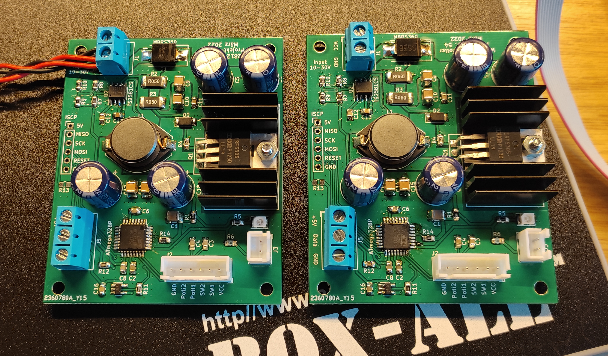
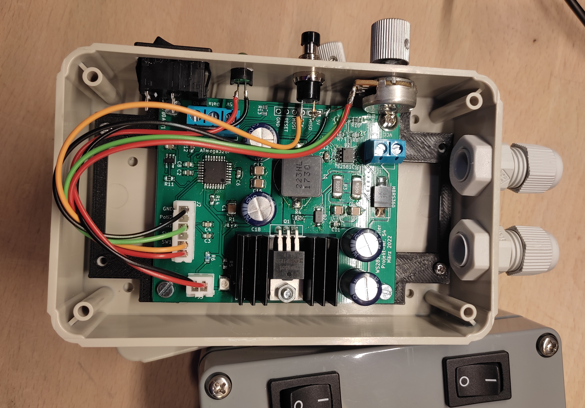

# simpleWS2812_LED_Controller
WS2812 LED Controller with AVR µC and 5V Buck-Converter

<ins>Software/µC:</ins>
- **ATMega328P-AU**
- 8 different color effects
- see "AVR_Code" for code and fuse setting

<ins>Hardware:</ins>
- 12V Input
- 5V Output
- max. 5m strip length

finished Board and construction with case:

